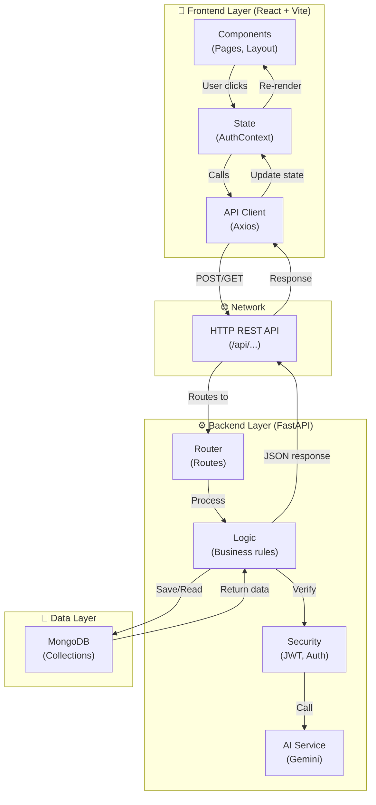

# System Architecture Overview

## Layer Diagram



---

## File Ownership by Layer

### 🎨 Frontend Layer (React)
These files handle UI, user interaction, and state:

| File | Purpose |
|------|---------|
| [frontend/src/App.jsx](frontend/src/App.jsx) | Routes and app structure |
| [frontend/src/components/layout/Layout.jsx](frontend/src/components/layout/Layout.jsx) | Main sidebar + layout shell |
| [frontend/src/pages/\*.jsx](frontend/src/pages) | Page components (Dashboard, Reviews, etc.) |
| [frontend/src/context/AuthContext.jsx](frontend/src/context/AuthContext.jsx) | Login state & user info |
| [frontend/src/index.css](frontend/src/index.css) | All styling |

**Responsibility:** Display UI, capture user input, manage UI state

---

### 🌐 API Layer (HTTP REST)
This is the contract between frontend and backend:

| File | Purpose |
|------|---------|
| [frontend/src/services/api.js](frontend/src/services/api.js) | Axios config + all API endpoints |

**Endpoints used:**
- `/api/auth/login` — login
- `/api/auth/register` — register
- `/api/auth/me` — get current user
- `/api/auth/profile` — update profile
- `/api/auth/password` — change password
- `/api/reviews` — create/list reviews
- `/api/reviews/{id}` — get/delete review
- `/api/stats` — get dashboard stats
- `/api/collections` — manage collections

**Responsibility:** HTTP communication between frontend and backend

---

### ⚙️ Backend Layer (FastAPI)
These files handle business logic, data validation, and AI processing:

| File | Purpose |
|------|---------|
| [backend_fastAPI/app/main.py](backend_fastAPI/app/main.py) | App entry point, router setup |
| [backend_fastAPI/app/routes/auth.py](backend_fastAPI/app/routes/auth.py) | Login, register, profile endpoints |
| [backend_fastAPI/app/routes/reviews.py](backend_fastAPI/app/routes/reviews.py) | Review creation & AI calling |
| [backend_fastAPI/app/routes/stats.py](backend_fastAPI/app/routes/stats.py) | Dashboard stats endpoint |
| [backend_fastAPI/app/routes/collections.py](backend_fastAPI/app/routes/collections.py) | Collections CRUD |
| [backend_fastAPI/app/utils/security.py](backend_fastAPI/app/utils/security.py) | JWT token generation/validation |
| [backend_fastAPI/app/utils/gemini.py](backend_fastAPI/app/utils/gemini.py) | Google Gemini AI integration |
| [backend_fastAPI/app/database.py](backend_fastAPI/app/database.py) | MongoDB connection |
| [backend_fastAPI/app/config.py](backend_fastAPI/app/config.py) | Environment settings (.env) |

**Responsibility:** Process requests, call AI, save/read from database, return JSON

---

### 💾 Data Layer (MongoDB)
These files define what data looks like:

| File | Purpose |
|------|---------|
| [backend_fastAPI/app/models/user.py](backend_fastAPI/app/models/user.py) | User document schema |
| [backend_fastAPI/app/models/review.py](backend_fastAPI/app/models/review.py) | Review document schema |
| [backend_fastAPI/app/models/collection.py](backend_fastAPI/app/models/collection.py) | Collection document schema |
| [backend_fastAPI/app/models/stats.py](backend_fastAPI/app/models/stats.py) | Stats document schema |

**Responsibility:** Define data structure, validation

---

## Request Flow Example

### Example: User submits code for review

1. **Frontend:** User enters code in [NewReview.jsx](frontend/src/pages/NewReview.jsx)
2. **Frontend:** Clicks "Submit Review" button
3. **Frontend:** Component calls `reviewApi.createReview(code)` from [api.js](frontend/src/services/api.js)
4. **HTTP:** Axios sends `POST /api/reviews { code: "..." }`
5. **Backend:** [reviews.py](backend_fastAPI/app/routes/reviews.py) receives request
6. **Backend:** Validates user token via [security.py](backend_fastAPI/app/utils/security.py)
7. **Backend:** Calls Google Gemini AI via [gemini.py](backend_fastAPI/app/utils/gemini.py)
8. **Backend:** Saves review to MongoDB via [models/review.py](backend_fastAPI/app/models/review.py)
9. **Backend:** Updates stats via [stats.py](backend_fastAPI/app/routes/stats.py)
10. **Backend:** Returns `{ id: "123", score: 85, issues: [...] }` as JSON
11. **HTTP:** Axios receives response
12. **Frontend:** Component updates state
13. **Frontend:** UI shows review result

---

## Key Design Principles

| Principle | Why | Example |
|-----------|-----|---------|
| **Separation of concerns** | Each layer has one job | Frontend doesn't touch DB, Backend doesn't render HTML |
| **API contract** | Frontend and Backend communicate via REST | Both must agree on endpoint URLs and JSON format |
| **No direct DB access from browser** | Security | Frontend must use backend to access MongoDB |
| **Stateless backend** | Scalability | Backend doesn't store user sessions, uses JWT tokens |
| **Centralized API client** | Maintainability | All requests go through `api.js`, one place to add interceptors |

---

## How to Add a New Feature

### Example: Add a "like review" feature

**Step 1: Database** — Update [backend_fastAPI/app/models/review.py](backend_fastAPI/app/models/review.py)
```python
class Review(Document):
    ...
    likes: int = 0
```

**Step 2: Backend route** — Add endpoint to [backend_fastAPI/app/routes/reviews.py](backend_fastAPI/app/routes/reviews.py)
```python
@router.post("/reviews/{id}/like")
async def like_review(id: str):
    ...
```

**Step 3: Frontend API** — Add function to [frontend/src/services/api.js](frontend/src/services/api.js)
```javascript
export const reviewApi = {
  ...
  likeReview: (id) => api.post(`/reviews/${id}/like`),
};
```

**Step 4: Frontend UI** — Add button to [frontend/src/pages/ReviewDetail.jsx](frontend/src/pages/ReviewDetail.jsx)
```javascript
const handleLike = async () => {
  await reviewApi.likeReview(reviewId);
};
```

---

## Deployment Strategy

| Layer | Deployment | Port |
|-------|-----------|------|
| Frontend | NPM build → static files → Netlify/Vercel | 3000 (dev) |
| Backend | Python + FastAPI → Server → Railway/Heroku | 8000 (dev) |
| Database | MongoDB Atlas (cloud) or local | 27017 (local) |

The frontend talks to backend via the API URL (e.g., `https://api.yourapp.com/api/...`)

---

## Summary

Your architecture is correct:

- ✅ Frontend is React (UI only)
- ✅ Backend is FastAPI (logic + data)
- ✅ Communication is HTTP REST
- ✅ Database is MongoDB
- ✅ No direct access from browser to database

This is a **standard 3-tier architecture** used by most web apps.
